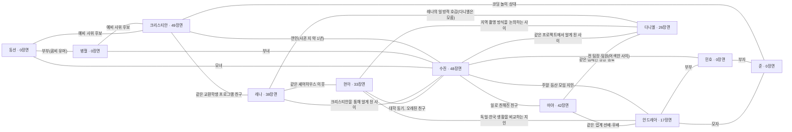

# 한글소리 페르소나·관계 현황 감사

현재 파일에서 확인한 사실과 정리 제안입니다. 연령 변경이나 새 관계는 아직 정본에 적용하지 않았습니다.

- 기준 HEAD: `bd479d969865ca24333219f4392d8e9cf9477254`
- 실제 대화 시나리오: 178개 (A1–C2)
- 반복 인물: 11명 / 일반 역할: 18종 / 관계 그래프: 23개 연결

## 인물별 현재 설정과 사용량

| 인물 | 현재 연령 설정 | 역할 | 등장 장면 | 학습자 역할 장면 |
|---|---|---|---:|---:|
| 크리스티안 | 24세 | 한국의 교환학생 | 49 | 43 |
| 수진 | 27세 | 데이터 분석가이자 앱 개발자 | 48 | 27 |
| 마야 | 25세 | K-pop 마케팅 회사 신입 | 42 | 30 |
| 현아 | 29세 | 도시·문화 연구 대학원생 | 33 | 24 |
| 안드레아 | 40세 | 외국계 기업 재무 리더 | 17 | 6 |
| 레나 | 23세 | 한국의 교환학생 | 38 | 27 |
| 다니엘 | 30세 | 프리랜서 영상 제작자 | 26 | 20 |
| 민호 | 42세 | IT 회사 팀장 | 0 | 0 |
| 동선 | 61세 | 쥬얼리 가게 사장(수원 남문 근처 가게, 액세서리·귀금속 소매, 단골이 많다) | 0 | 0 |
| 병철 | 64세 | 전기기술사(전기 설비 안전 점검·감리, 현장 경험이 많다) | 0 | 0 |
| 준 | 9세 | 초등학교 3학년 학생 | 0 | 0 |

## 확인한 정리 과제

1. 실제 주연 7명과 아직 등장하지 않는 가족 인물 4명의 역할을 구분해야 합니다.
2. 준은 현재 9세·초3이며, 안드레아·민호의 아들입니다. 실제 대화 등장 0건이므로 연령 재검토가 기존 준 대사와 충돌하지는 않습니다. 프로필·관계·작가 지침·음성 계약은 함께 검토해야 합니다.
3. 정확한 나이는 relationshipGraph.consistencyRules.fixedFacts에 11명 모두 기록돼 있습니다. 인물 설명에는 상대 나이 또는 연령대만 있어, 읽는 위치에 따라 설정을 놓치기 쉽습니다. 한 인물 표에서 정확한 나이와 역할을 함께 보여 주는 방식으로 정리해야 합니다.
4. 관계를 인물별 설명과 relationshipGraph에 중복 기록하고 있어 아래 연결이 어긋나 있습니다. 단방향 호감과 인물별 인지 차이는 의도된 서사로 구분해야 합니다.

- 레나 → 마야: 상대 프로필에 대응 설명 없음. 그래프에는 없음.
- 레나 → 수진: 상대 프로필에 대응 설명 없음. 그래프에는 존재.
- 다니엘 → 수진: 상대 프로필에 대응 설명 없음. 그래프에는 존재.
- 관계 그래프 누락: 레나 ↔ 마야

## 정리 방향 제안

- 현재 11명과 안정된 캐릭터 ID를 유지하면서 주연 7명·가족 조연 4명으로 역할을 명확히 합니다.
- 연령·직업·거주·언어 능력·주요 목표·약점을 각 인물의 한 표로 정리하고, 외형은 그 표를 따라 제작합니다.
- 관계를 가족, 연애, 친구/동거, 직장/협업으로 정리합니다. 모든 관계에는 서로를 아는 경로와 현재 거리감을 기록합니다.
- 양쪽 프로필의 설명과 관계 그래프를 일치시키되, 짝사랑이나 숨겨진 연결의 정보 차이는 별도로 유지합니다.
- 기존 학습자를 특정 페르소나와 동일시하지 않고, 장면에서 맡는 역할과 인물의 정체성을 구분합니다.
- 준의 연령대와 관계 서사의 강도를 확정한 뒤 상세 재배치안과 대표 대화 예시를 작성합니다.

## 현재 관계 지도

## 검증 범위

사용량은 현재 assets/data/scenarios_a1–c2.json의 participantIds와 실제 dialog 화자를 기준으로 집계했습니다. 사용자 화자는 playerCharacterId로 해석했습니다.
카드·단어 예문·미승격 후보의 이름 언급까지 0건이라는 뜻은 아닙니다. 상세 장면 목록과 원본 SHA-256은 persona_usage.json에 있습니다.
앱 코드·현재 페르소나 정본·콘텐츠·TTS·진도·보상·실사용 에셋은 이 감사로 변경하지 않았습니다.
