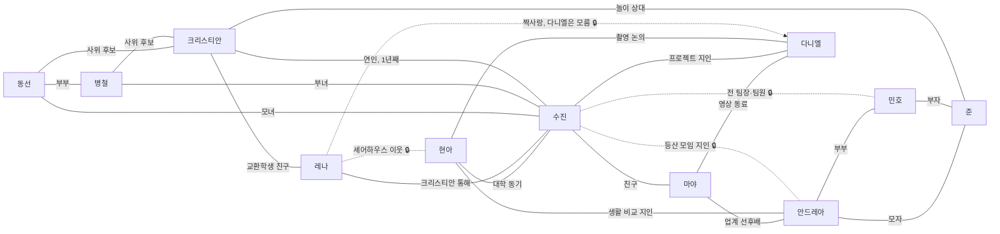

# 페르소나 말투 스펙 (P1)

> **정본 데이터:** `tools/content_factory/canonical_scenarios/character_profiles.json`
> → `recurringCharacters[].speechStyle`, 최상위 `speechStylePolicy`, 그리고
> 인물 관계망 `relationshipGraph`. 이 문서는 그 JSON을 사람이 읽고 바로 쓸 수
> 있게 풀어 쓴 작성 가이드다. 두 문서가 어긋나면 JSON이 정본이고, 이 문서를
> 고친다.
>
> 가드레일: `tools/content_factory/test_character_profiles_speech_style.py`
> (11명 전원 speechStyle 필수 키·byLevel A1/A2/B1+·정책 문자열 검사 +
> relationshipGraph의 edge·hiddenLinks·storyArcs 정합성 검사),
> `tools/content_factory/validate_content.py --json`,
> `test/scenario_character_contract_test.dart`,
> `tools/content_factory/test_scenario_corpus_pipeline.py`.

## 1. 목적

11명의 상시 등장 캐릭터 — 크리스티안·수진·마야·현아·안드레아·레나·다니엘(원
7인) + 민호·동선·병철·준(가족 확장) — 가 장면·레벨에 상관없이 "같은
목소리"로 뭉개지는 문제를 막기 위한 스펙이다. `character_profiles.json`의
`personality`/`writerHints`가 **성격**을 서술한다면, `speechStyle`은 그
성격이 **실제 대사의 표지(marker)**로 어떻게 드러나는지를 레벨별로 고정한다.
`relationshipGraph`는 그 위에 "누가 누구와 어떻게 얽혀 있는가"를 — 공개된
관계뿐 아니라 아직 서로 모르는 숨은 연결까지 — 구조화한다. 시나리오
작성자·검수자·모델 세션 누구나 이 문서와 JSON만 보고 "이 캐릭터라면 이렇게
말한다", "이 두 사람은 이런 관계다"를 판단할 수 있어야 한다.

## 2. 정책

```
말투 표지는 레벨 문법 안에서만 쓴다:
A1 = 감탄사·문장 종류·호칭·간단 반응,
A2 = 반말 전환·짧은 관용표현,
B1+ = 어조·하지 않는 말까지.
```

이 문장이 `speechStylePolicy`로 JSON에 그대로 들어 있다. 즉:

- **A1**: 캐릭터를 감탄사(와!/글쎄요), 문장 종류(질문형으로 끝맺는지),
  상대를 부르는 방식(이름을 부르는지), 정해진 짧은 반응 한마디로만
  구분한다. 새 문법을 끌어오지 않는다.
- **A2**: 존댓말/반말 전환(수진의 "괜찮아, 천천히 해"처럼 친해지면
  반말이 섞이는 것), 그리고 짧은 관용표현("그럼 그렇지", "대박")을
  더한다.
- **B1+**: 어조(단정적인지 유보적인지) 자체와, **그 캐릭터가 하지
  않는 말**(안드레아는 냉대하지 않는다, 마야는 실수를 가볍게 넘기지
  않는다)까지 다룰 수 있다.

레벨을 건너뛰어 표지를 당겨 쓰지 않는다 — 예를 들어 A1 시나리오에
수진의 반말("괜찮아, 천천히 해")을 넣지 않는다.

## 3. 캐릭터 × 말투 표지

| 캐릭터 | KO 핵심 표지 | DE | EN | 피해야 할 것 |
| --- | --- | --- | --- | --- |
| **크리스티안** (christian) | 확인 질문 "…맞아요?/…죠?", 반응 "아, 네!"·"아, 그렇구나"(A2+), 사과·인정 먼저("아, 죄송해요. 제가…"), 단어 찾기 망설임("음… 그… 이거요"). IT 얘기에서만 또렷·길어짐 | höflich, zögerlich (ähm, glaube ich), bleibt lange beim Sie | polite, hedges ("I think", "maybe") | 자신감 넘치는 단정, 명령 |
| **수진** (sujin) | 짧고 명확, 결론 먼저, 건조한 한 줄 농담("그럼 그렇지."), 챙김은 행동으로("이거 드세요.", "제가 할게요."), 친해지면 반말(A2+) | knapp, präzise, trockener Humor, Sie bei Fremden | crisp, understated | 강의식 설명, 과장 |
| **마야** (maya) | 감탄 "와!"·"진짜요?" 빈번, 질문 빠르고 많음, 이름을 자주 부름("수진 씨!"), 느낌표 문장, "대박"(A2+) | enthusiastisch, Ausrufe ("Echt jetzt?!"), schnelles du | upbeat American English ("No way!", "So cool!") | 침착한 장문 |
| **현아** (hyuna) | 차분, 맥락 설명("그건 …라서요"), 일반화 회피("사람마다 달라요"), 되묻는 질문 | ruhig, differenziert ("kommt darauf an") | measured, nuanced | 단정, 유행어 |
| **안드레아** (andrea) | 격식(업무는 -습니다, 사적은 해요체), 지시·순서형("먼저 …하세요. 그다음에…"), 칭찬은 짧고 뒤에 조건("잘했어요. 다음엔 시간 지키세요.") | Sie, direkt, Fachbegriffe, kurze Sätze | direct, professional | 냉대·모욕, 감정 과장 |
| **레나** (lena) | 밝고 친근, 제안형("같이 …할까요?/가요!"), 감정 공유("저도요!", "아쉬워요"), 어색함 눈치채면 화제 전환 | freundlich, schnell du, "Lass uns…" | warm, inviting | 모든 장면을 늘 밝게만 끝내기 |
| **다니엘** (daniel) | 쾌활, 사람 편하게("괜찮아요, 천천히요"), 이미지·촬영 비유("이거 찍으면 예쁘겠어요"), 유머 뒤 진지한 한마디 | warm, spielerisch, du | playful, easygoing | 실수를 유머로만 덮기 |
| **민호** (minho) | 부드러운 존댓말, 회의체 "그럼 이렇게 정리하죠", 집에서는 요리 얘기, 아내 앞에서 농담이 는다 | höflich, sachlich | soft-spoken, professional | 권위적 명령 |
| **동선** (dongsun) | 감탄+웃음("아이고, 왜 이렇게 예뻐"), 반복 권유("먹어, 먹어"), 딸에겐 반말·크리스티안에겐 해요체→금방 "우리 크리스티안" | warm, kontaktfreudig | warm, quick to include people | 냉소, 며느리 압박형 발언 |
| **병철** (byeongcheol) | 평소 짧은 격식체·딸에게 짧은 반말("왔냐"); 술자리에서만 "그게 말이지…", "옛날에는…"으로 역사(수원 화성·정조) 강의가 길어진다 | nüchtern wortkarg, nach Alkohol gesprächig | terse sober, talkative after a drink | 사투리 과다, 권위적 훈계, 과음 미화 |
| **준** (jun) | 반말·짧은 문장, "왜?"/"진짜?", 숫자·게임 얘기, 엄마에게만 독일어를 섞는다 | kindlich, Deutsch-Koreanisch gemischt | childlike, short sentences | 어른 어휘 |

## 4. 레벨별 예문

각 캐릭터마다 A1(1급 문법만) 3문장, A2(1·2급 문법만) 2문장. 표지를
굵게 표시했다.

### 크리스티안
- A1: **아, 네!** 여기 있어요.
- A1: 이거 **맞아요?**
- A1: **죄송해요**, 제가 늦었어요.
- A2: **아, 그렇구나**, 몰랐어요.
- A2: 잠깐만요, **제가 볼게요.**

### 수진
- A1: **네.**
- A1: **이거요.**
- A1: **제가 할게요.**
- A2: **그럼 그렇지.**
- A2: **괜찮아**, 천천히 해.

### 마야
- A1: **와!** 예뻐요.
- A1: **진짜요?**
- A1: **수진 씨**, 이거 봐요!
- A2: **대박**, 완전 좋아요!
- A2: 이거 진짜 **대박**이에요.

### 현아
- A1: **글쎄요.**
- A1: **왜요?**
- A1: **그래요?**
- A2: **사람마다 달라요.**
- A2: 그건 좀 다른 것 같아요.

### 안드레아
- A1: **먼저** 이거 하세요.
- A1: **시간 지키세요.**
- A1: 여기 앉으세요.
- A2: **잘했어요.** 다음엔 시간 지키세요.
- A2: 다음엔 미리 말하세요.

### 레나
- A1: **같이 갈까요?**
- A1: **저도요!**
- A1: 우리 같이 사진 찍어요!
- A2: **아쉬워요**, 벌써 가요?
- A2: **드라마에서 봤어요!**

### 다니엘
- A1: **괜찮아요**, 천천히요.
- A1: 여기 예뻐요!
- A1: 이거 찍으면 예쁘겠어요.
- A2: 이거 **찍을까요?**
- A2: 하하, 다시 해요.

### 민호
- A1: 안녕하세요.
- A1: 이거 맛있어요.
- A1: 그럼 이렇게 해요.
- A2: **그럼 이렇게 정리하죠.**
- A2: 요리는 제가 할게요.

### 동선
- A1: **이거 먹어요.**
- A1: **얼마예요?** 싸게 줄게요.
- A1: **아이고**, 왜 이렇게 예뻐!
- A2: 수진이 **어릴 때는요…**
- A2: 다음에 또 와요, **꼭!**

### 병철
- A1: **왔냐.**
- A1: 불 **꺼요.**
- A1: 이거 위험해요.
- A2: 이거 고쳐 줄게.
- A2: **옛날에는** 여기가 궁궐이었어요.

### 준
- A1: **왜?**
- A1: **진짜?**
- A1: 몇 개야?
- A2: 이거 게임 진짜 재밌어.
- A2: 나 이거 할 줄 알아.

## 5. 적용 규칙

1. **표지는 그 캐릭터의 목록에서만 고른다.** 새 시나리오·예문을 쓸 때는
   `speechStyle.ko.markers`(또는 §3 표)에 없는 표현을 새로 지어내지
   않는다. 필요하면 이 문서·JSON에 먼저 추가하고 쓴다.
2. **한 장면에 두 캐릭터가 나오면 표지만으로 구분되어야 한다.** 예를
   들어 크리스티안과 수진이 같은 장면에 있으면, 이름표를 지워도
   "확인 질문·망설임(크리스티안)"과 "짧고 결론부터(수진)"만으로 누가
   말했는지 알 수 있어야 한다. 검수 시 이름을 가리고 읽어 구분이
   안 되면 대사를 다시 쓴다.
3. **A1 예문은 문장당 표지 하나만 쓴다.** A1은 문법 자체가 단순하므로
   표지를 겹쳐 쓰면(예: "아, 네! 맞아요? 죄송해요"를 한 문장에) 학습자가
   문법과 캐릭터 표지를 구분하지 못한다. §4의 A1 예문처럼 문장을
   쪼갠다.
4. **레벨을 건너뛰지 않는다.** A1 대사에는 A2/B1+ 전용 표지(반말 전환,
   관용표현, 어조 판단)를 쓰지 않는다. byLevel의 레벨 키가 그 경계다.
5. **MBTI/배경 설정으로 표지를 대체하지 않는다.** `mbtiPolicy`와 같은
   원칙으로, `speechStyle`도 "약한 힌트"가 아니라 실제로 대사에 넣어야
   하는 표지 목록이다. 성격 서술만 보고 표지를 새로 창작하지 않는다.
6. **관계는 `relationshipGraph`에 없는 것을 새로 지어내지 않는다.** 두
   캐릭터를 한 장면에 같이 쓰려면 먼저 `relationshipGraph.edges`에서 그
   관계를 찾는다. 없으면 이 문서·JSON에 엣지를 먼저 추가한다.

## 6. 관계도

`relationshipGraph`(스키마 v1)는 11명 전원이 최소 하나의 관계로 이어지도록
설계했다 — "알게 모르게 엮인 인간사"를 다루되, 레벨이 낮을수록 사실만
보여주고 갈등(`tensions`)은 B1부터 대사에 드러낸다(§6.4 고정 규칙 참고).

### 6.1 관계 그래프

실선은 서로 아는 공개된 관계, 점선(`-.-`)은 **당사자 중 일부 또는 전부가
아직 모르는** 연결이다. 🔒 표시는 §6.2 숨은 링크 표와 연결된다.



### 6.2 숨은 링크(hiddenLinks)

| 관련 엣지 | 아는 정도 | 숨겨진 사실 | 공개 레벨 | 공개 장면 |
| --- | --- | --- | --- | --- |
| sujin–minho, sujin–andrea | 아무도 모름 | 수진은 주말 등산 모임에서 안드레아를 알지만, 안드레아의 남편이 자신의 전 팀장 민호인 줄은 모른다. | B1 | 안드레아의 저녁 초대 자리에서 남편 민호를 소개받은 수진이 예전 팀장임을 알아본다. |
| lena–hyuna | 아무도 모름 | 레나와 현아는 같은 셰어하우스 이웃이지만, 둘 다 수진을 안다는 사실은 서로 모른다. | A2 | 셰어하우스에서 우연히 수진 이야기가 나오며 "우리 둘 다 수진 씨 알아요?"로 서로 알아챈다. |
| lena–daniel | 레나만 앎 | 레나는 다니엘에게 마음이 있지만 다니엘은 전혀 눈치채지 못한다. | B1 | 레나가 다니엘 이야기를 할 때 조금 들뜨는 장면으로만 암시한다 — **고백이나 결말로 이어가지 않는다(결말 강요 금지).** |

### 6.3 레벨별 아크 씨앗(storyArcs)

**A1** — 사실 관계만, 일상 상황:
- 크리스티안과 수진이 카페에서 처음 이야기를 나눈다.
- 크리스티안과 수진이 수원 가는 기차·버스를 타고, 화성 성곽길을 산책하고, 저녁으로 수원 왕갈비를 먹는다.
- 레나가 길을 묻는 사람에게 방향을 알려준다.
- 준이 크리스티안과 숫자로 게임 점수를 센다.
- 가족 사진을 보여주며 서로를 소개한다.

**A2** — 관계가 한 단계 깊어지는 사건:
- 크리스티안과 수진이 사귄 지 100일을 축하한다.
- 레나와 현아가 셰어하우스에서 둘 다 수진을 안다는 걸 알게 된다.
- 크리스티안이 수원을 처음 방문해 동선의 가게에서 귀걸이 선물을 같이 고르고, 병철과 화성 성곽길을 걷는다.
- 준의 학교 행사에 안드레아와 민호가 함께 간다.
- 마야가 다니엘이 촬영한 캠페인 영상 피드백을 준다.

**B1** — 숨은 연결이 드러나고 첫 갈등이 나오는 지점:
- 안드레아의 저녁 초대에서 수진이 민호가 예전 팀장이었다는 걸 알아챈다.
- 저녁 술자리에서 정조가 왜 수원을 아꼈는지 이야기하며 병철의 말문이 트이고, 결국 취한 병철이 춤을 춰서 수진이 부끄러워하고 크리스티안은 오히려 호감을 느낀다.
- 크리스티안이 독일 귀국과 한국 인턴 사이에서 고민한다.
- 다니엘이 지역 주민들에게 촬영 동의를 구한다.
- 도시·문화를 연구하는 현아가 화성 답사에 관심을 보이다가 수진 가족과 우연히 연결된다.

**B2** — 제도·현실 문제로 넓어지는 갈등:
- 크리스티안이 비자 연장 문제로 고민한다.
- 크리스티안과 수진이 장거리 연애 가능성을 의논한다.
- 안드레아가 직장에서 역할과 책임 문제로 갈등한다.
- 현아가 다니엘의 촬영과 관련한 연구 윤리 문제를 다시 논의한다.

**C1+** — 제도·문화 비교 토론:
- 현아와 안드레아가 독일과 한국의 육아휴직 제도를 비교한다.
- 마야와 안드레아가 두 나라의 직장 문화 차이를 토론한다.
- 다니엘과 현아가 지역 개발과 관광 윤리를 논의한다.

### 6.4 고정값·일관성 규칙(consistencyRules)

`relationshipGraph.consistencyRules.fixedFacts`에 11명 전원의 나이·직업·
거주지가 고정값으로 있다(시간축 **2026년** 기준). 새 시나리오·번역에서 이
값을 임의로 바꾸지 않는다. 특히:

- 수진의 고향·부모님(동선·병철) 거주지는 **수원**이다. 수진 본인은
  **서울**에서 직장을 다니며 산다. 크리스티안은 서울의 교환학생이다.
- 병철의 역사 이야기는 **정조와 수원 화성(1794~1796년 축성, 유네스코
  세계유산)**에 근거한 것만 쓴다 — 다른 왕(세종 등)과 수원을 엮는 서술은
  역사 오류이므로 넣지 않는다.
- **레벨이 낮을수록 관계는 사실만 다룬다.** 갈등·긴장(`tensions`)은
  B1부터 대사에 드러낸다 — A1·A2 시나리오에서 `tensions` 필드는 작가
  참고용일 뿐, 대사에 노출하지 않는다.
