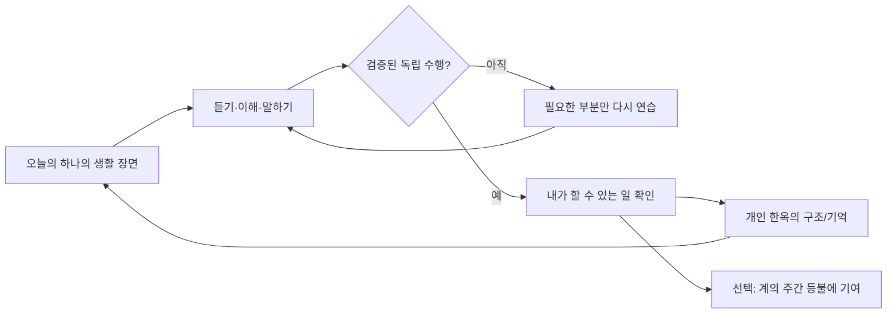

# Hangul Sori UX Rebuild — 화면 계약과 구현 계획

> 상태: **설계 확정 전 목업 및 구현 계획** · 작성일: 2026-08-10  
> 범위: 학습 진입 흐름, 한옥의 의미, 계의 협력 흐름, 탐색 구조.  
> 비범위: 기존 학습 데이터의 재작성, 한옥 에셋 교체, Firebase 보안 규칙 완화, 코스 숙달 기준 완화.

함께 볼 파일: [`HANGUL_SORI_UX_REBUILD_MOCKUPS.html`](HANGUL_SORI_UX_REBUILD_MOCKUPS.html)

## 0.1 2026-08-10 재검증 기준선 — 구현 전에 고정한 사실

이 계획은 목업만 보고 작성하지 않는다. 현재 checkout의 **추적 파일 1,293개**를 재인덱싱하고, 바뀔 가능성이 있는 UI·도메인·route·테스트 파일을 다시 읽어 아래의 경계를 확인했다. PNG/MP4 같은 바이너리 자산을 전부 디코딩하거나 앱의 모든 route를 실행한 것은 아니다. 이 표는 “무엇을 실제로 읽고 어떤 범위만 바꾸는가”의 정확한 경계다.

| 영역 | 현재 코드에서 확인한 사실 | 설계가 지켜야 할 결과 |
|---|---|---|
| 앱 시작 | `SplashScreen`은 2초 후 첫 실행에 `QuickOnboardingScreen`, 두 번째 세션에 `IntroGateScreen`, 그 뒤에는 `AppShell`로 간다. | 새 흐름은 이 세 갈래와 restore state를 함께 바꾼다. Quick 화면만 교체해서 둘째 세션이 다른 경로로 새지 않게 한다. |
| 첫 실행 저장 | Quick onboarding은 goal을 저장한 뒤 `hasCompletedOnboarding`·`sessionCount`를 먼저 쓰고 Consent로 간다. Consent는 Preview → Character → Level 또는 Home을 고른다. Character는 현재 2.4초 선택 연출 뒤 Level로 간다. | 동의 전 완료 상태가 남거나, Preview/Character를 건너뛴 사용자가 level 없이 Home에 들어가는 migration을 만들지 않는다. |
| 오늘의 시작 | `HomeScreen._missionHeroContent`의 네 추천 종류는 모두 `/sarangbang`으로 push한다. `SarangbangStudyScreen._openRecommendation`만 `ensurePackAccess`를 거쳐 snapshot의 exact route/arguments를 push한다. | Home CTA를 direct route로 바꿀 때 pack gate를 복제·누락하지 않는다. 공용 executor를 만든 뒤 Home과 Sarangbang이 함께 쓴다. |
| 코스 | `CourseMissionScreen`은 현재 unit의 graph link를 action으로 만들고 role 우선순위를 `assess → practice → introduce → review`로 정렬하며, 첫 action을 바로 시작 버튼으로 쓴다. | 보기 좋은 3단계 UI 때문에 graph link·route·assessment provenance를 버리거나 `assess`를 가짜 완료로 만들지 않는다. |
| 숙달 | `CourseMasteryService`는 typed `CoursePracticeContext`가 있는 grammar/smalltalk assessment와 현재 unit의 declared scenario assessment만 `courseEligible`로 인정한다. free browse는 history다. unit checkpoint는 최신 score가 threshold(기본 0.7) 이상이어야 한다. | 미션 프레임은 이 증거를 읽기만 하며, 버튼 탭·화면 열람·장식 보상으로 mastery를 쓰지 않는다. |
| 개인 한옥 | `HanokStage`와 `PersonalHanokProjection`은 현재 `LevelRatios`를 입력으로 한다. legacy courtyard, full map gate, room placement, reveal storage가 이미 별도 테스트된다. | Release A는 narrative/copy/layout만 바꾸고 stage, unlock, asset path, placement 저장을 변경하지 않는다. |
| 계 | `GyeHanok`은 `weeklyGoalPacks`, `weeklyGoalProgress`, `lifetimeGoalsAchieved`를 렌더한다. 서버의 `on_pack_cleared`만 주간 진행을 올리고 rollover가 MVP/XP boost를 쓴다. | 화면 문구·위계만 바꾸는 Release A와 event/schema/rules가 필요한 Release B를 절대 한 PR로 섞지 않는다. |

### 실행한 기준선 테스트

아래 Flutter 테스트는 **변경 전** 현재 checkout에서 통과했다.

| 묶음 | 실행 결과 | 의미 |
|---|---:|---|
| Today, Home, Sarangbang, responsive | 70 passed | 단일 snapshot, route 대상, room scene, 1/2열, 좁은 화면·접근성 기준선 |
| Course graph, route, evidence, mastery sync | 86 passed | typed context, exact assessment, checkpoint, 병합·저장 무결성 기준선 |
| Hanok stage, world, map, reveal, venue | 69 passed | 12 stage, full-map gate, asset bundle, 44dp map target, reveal/placement 기준선 |
| Gye Flutter model/UI/write gate | 69 passed | membership epoch, moderation/leave, dedication CAS, write fail-closed 기준선 |

`functions/gye`의 clean dependency install 뒤 Node unit tests는 실행 가능해졌지만, 이 Windows 환경에는 Firestore Emulator가 요구하는 Java가 없다. Node 결과와 rules-emulator 결과를 같은 것으로 취급하지 않으며, Release B deploy gate에는 Java가 있는 clean environment에서의 rules-emulator 실행을 남긴다.

## 0. 제품 결정

Hangul Sori의 차별점은 “재미있는 문제를 많이 푸는 앱”이 아니라 **한 사람의 실제 한국 생활을 조금씩 지을 수 있게 돕는 앱**이다.

따라서 제품의 반복은 다음으로 고정한다.

듀오링고식 루프에서 가져올 것은 **짧은 한 행동, 즉시 피드백, 다음 행동의 명확성**뿐이다. 연속 출석, 생명, 무한 XP, 경쟁 순위는 중심 동기로 쓰지 않는다.

| 보이는 변화 | 의미 | 증거 원천 | 해서는 안 되는 일 |
|---|---|---|---|
| 한옥의 구조 단계 | 생활 장면을 실제로 해결할 준비가 쌓임 | 기존 코스 활성 맥락 + 정확한 `assess` + 시나리오별 독립 70% | 단순 열람, 재생, 임의 탭으로 구조를 올리기 |
| 단어·방 꾸미기 | 학습을 계속한 가벼운 기억 | 기존 팩·리뷰·퀘스트 보상 | 한옥 구조와 동일시하거나 강제 결제로 만들기 |
| 계의 등불 | 그룹에 검증된 학습 행동을 보탬 | 검증된 그룹 기여 이벤트만 | 개인 답·정확도·단어·문장을 공개하기 |

## 1. 정보 구조

하단 다섯 탭은 유지한다. 사용자가 지금 학습할 수 있는 길과, 자유롭게 탐색하는 길을 분리한다.

| 탭 | 한 문장 약속 | 새 첫 화면 | 보존하는 현재 기능 |
|---|---|---|---|
| `Heute` | 오늘 할 한 가지 | Today / Home | `TodayLearningSnapshot`, 리뷰·코스·팩·시나리오 추천 |
| `Üben` | 이미 필요한 것을 단단히 | 목적 기반 Practice Hub | 리뷰, 약점, 발음, 문법, 게임, 단어장 |
| `Entdecken` | 도구와 문화 찾기 | 검색 우선 Discover | 최근 추가된 24개 활동, OCR, 사전, 책, 문화 기능 |
| `계` | 선택적인 공동 약속 | 안전한 그룹 랜딩 | 생성·가입·피드·스티커·응원·모더레이션 |
| `Ich` | 내 경로를 조절 | 프로필 | 목표, 레벨, 동행, 계정, 데이터·삭제 |

`나의 한옥`, `사랑방`, `나의 길`은 하단 탭을 더 늘리지 않는다. 각각 Home의 한옥 단서, 한옥 지도, Profile/한옥 장소의 목적지에서 들어간다.

## 2. 페이지별 정확한 화면 계약

아래 표의 “현재 구현 기반”은 바꿔도 되는 레이아웃이 아니라 반드시 연결해야 하는 데이터·보안 경계다. 화면 번호는 목업 HTML의 번호와 같다.

| # | 페이지와 목적 | 첫 화면에서 보이는 것 | 단 하나의 주 행동 | 구현 계약 / 현재 기반 |
|---|---|---|---|---|
| 01A | 필수 동의 | 개인정보·그룹 자발성의 짧은 설명 | `Weiter` | `QuickOnboardingScreen`의 동의 경로는 유지. 분석/계정 동의 없이 추적을 시작하지 않는다. |
| 01B | 목표·출발점 | 생활 목적 3개 + 처음/기존 학습자 선택 | `Meine erste Szene öffnen` | `onboarding_level_screen.dart`의 직접 레벨 선택과 8–10문항 진단을 “Ich kann schon etwas” 하위로 이동. 목적은 profile 저장 계약에 명시적으로 추가. |
| 01C | 첫 성공·동행 제안 | 첫 소리 이해, 선택형 동행 제안 | `Begleitung auswählen` / skip | 동행 미선택은 정상 상태. 첫 성공은 유효한 A1 활성 컨텍스트 안에서만 기록하며, 이 화면 자체는 숙달을 쓰지 않는다. |
| 01D | 동행 캐릭터 선택 | 기존 태고·조이 에셋, 성격, 현재 선택 | `Mit Begleitung zu Heute` / skip | 카드 탭은 화면 안에서만 미리 선택하고 CTA에서 `MascotPreference.set` 한 경로로 확정·전역 통지한다. Back/skip은 반쪽 선택을 저장하지 않으며 프로필에서 언제든 바꿀 수 있다. |
| 02A | Today / Home | 오늘 가능한 can-do, 시간, 하나의 미션 | `Szene beginnen` | `TodayLearningSnapshot`이 고른 최우선 목적지로 **직접** 이동. Home → `/sarangbang` → 동일 CTA 중복을 제거. |
| 02B | 미션 브리프 | 도착점, 상황, 3단계, 총 시간 | `Jetzt hören` | 현재 `CourseMissionScreen`의 긴 개념·보완 큐는 “나의 길” 보조 뷰로 이동. 실제 link 순서와 `CoursePracticeContext`는 유지. |
| 02C | 미션 학습 프레임 | 현재 단계, 한 문제, 힌트 | `Meine Antwort prüfen` | 새 문제 엔진을 만들지 않는다. 기존 Vocab/Grammar/Scenario 화면의 상단 `MissionContextBar`와 반환 규칙으로 구현. 유효한 `assess`만 코스 증거를 쓴다. |
| 02D | 미션 결과 | “내가 할 수 있는 일”, 신뢰도, 다음 구조 변화 | `Zurück zum Hof` | `CourseMastery`와 `Scenario` 결과를 읽어 표시. UI가 completion/mastery를 새로 쓰지 않는다. |
| 03A | 초반 한옥 | 기존 단계 그림 + 생활 능력 문장 | `Nächste Szene ansehen` | `HanokStageService`와 기존 12 stage asset을 그대로 쓴다. 새 `HanokBuildNarrative`는 읽기 전용 오버레이만 제공. |
| 03B | 후기 한옥 지도 | 장소 이름 + 무엇을 위해 가는지 | `Dorthin gehen` | `PersonalHanokProjection`, map zones, 접근성 목록을 유지. full map 해금 기준은 1차에서 바꾸지 않는다. |
| 03C | 사랑방 | 오늘 보관된 표현·배치·보상 | `Zur heutigen Szene` | `SarangbangScreen`은 재방문/꾸미기용. Today에서 중간 관문으로 강제하지 않는다. |
| 04A | Üben | 반복·집중 연습·자유 게임·내 단어 | 목적 카드 선택 | `PracticeHubScreen`의 목적지와 모든 기능을 보존. “목적 → 도구” 순서로 카드/문구만 바꾼다. |
| 04B | Entdecken | 검색, 범주, 기존 도구 | 검색 또는 도구 실행 | `DiscoverScreen`의 24개 활동과 최근 OCR/사전 경로를 삭제·병합하지 않는다. |
| 04C | 나의 길 | 현재 단원, 다음 단원, 완료 근거 | `Aktuelle Mission öffnen` | curriculum manifest, CourseProgress, CourseMastery 그대로. 열람은 history-only, checkpoint 70% 규칙을 가시화한다. |
| 05A | 계 첫 화면 | 자발성, 공개 범위, 가입/건너뛰기 | `Eine 계 finden oder gründen` | 16세 자가 확인, 가입/생성/안전 문구와 Firestore 권한 모델 유지. skip에 불이익 없음. |
| 05B | 주간 생활 약속 | 이번 주에 세 사람이 같은 생활 장면을 코스 흐름 안에서 완수 | `Meine heutige Szene öffnen` | 새 Gye의 schema v1만 세 고정 장면과 익명 `n/3` 합계를 사용한다. 기존 Gye는 `weeklyGoalPacks`를 계속 사용한다. Today는 현재 활성 코스의 다음 행동을 열며, 자유 탐색·다른 unit·70% 미만 결과는 계 기여가 아니다. |
| 05C | 계 마당 | 공동 등불, 안전한 응원, 피드 | `Eine sichere Nachricht senden` | pack/quest/level/goal/challenge/sticker/cheer 이벤트와 moderation 보존. MVP/XP boost는 주 표면에서 제거. |
| 06A | 프로필 | 내 목표·레벨·동행·데이터 제어 | 항목별 편집 | Profile와 account deletion recovery UI는 보존. 삭제를 단순 confirm으로 축소하지 않는다. |
| 06B | 오프라인/빈 상태 | 가능한 것과 불가능한 것 | `Gespeicherte Wörter wiederholen` | 로컬 콘텐츠, 재시도, 원격 필요 행동을 명확히 분기. 원격 write를 로컬 성공처럼 보이지 않는다. |
| 06C | 복습 우선일 | 왜 복습인지, 짧은 시간 | `Wiederholen` | 추천기가 review를 선택했을 때도 snapshot의 한 항목만 표시. 새 콘텐츠로 우회하는 이중 CTA 금지. |

### 2.1 목업 구현 상태 — 2026-08-11

> **2026-08-11 시각 패리티 재감사 완료.** 기존의 `[x]`는 일부 문구·상태·라우팅 테스트가 존재한다는 뜻으로 잘못 사용되었다. 아래 묶음은 실제 첫 화면, 정보 위계, CTA 수, 기존 콘텐츠 진입점, 상태별 반응형 렌더 계약을 구현하고 검증했다. Firestore Emulator, 실기기 접근성, 배포 및 Release B 외부 게이트는 이 완료 범위에 포함하지 않는다.

- [x] `01A`: 법적 동의만 남긴 시작 화면. `01B`의 목적·출발점 선택은 기존 구현을 시각 계약까지 재검증한다.
- [x] `01C`: 검증된 첫 성공 뒤의 선택 가능한 동행 제안과 즉시 Today 복귀.
- [x] `01D`: 기존 태고·조이 자산만 사용하는 명시적 선택 화면, 선택 저장·변경·건너뛰기·Today 복귀.
- [x] `02A–02D`: Today 단일 약속 → 짧은 미션 브리프 → 기존 플레이어 안의 다음 행동 → persisted can-do 결과.
- [x] `03A–03C`: 검증된 생활 능력 문장을 가진 한옥 → 장소 지도 → 재방문용 사랑방.
- [x] `04A–04C`: 목적 중심 연습 → 검색 가능한 발견 → 읽기 전용 완료 근거를 가진 나의 길.
- [x] `05A–05C`: 선택적인 계 진입 → 주간 생활 약속 → 안전한 공동 마당.
- [x] `06A–06C`: 편집 가능한 프로필 → 저장된 복습으로만 빠지는 안전한 빈 상태 → 복습 이유가 있는 단일 CTA.

**검증 완료 경계.** 각 화면은 (1) 목업 기본 상태, (2) CTA가 기존 실제 콘텐츠로 연결됨, (3) 안전/오프라인/완료 상태, (4) 308–480 phone 및 1.3 text scale 시각 회귀를 자동 검증했다. Flutter 비골든 테스트 257개 파일, `flutter gen-l10n`, 전체 `flutter analyze --fatal-infos`, `git diff --check`를 통과했다. Windows 로컬 렌더링 차이로 9개 Linux 골든 기준선은 별도이며 변경하지 않았다.

### 기존 세부 학습 화면의 처리

모든 활동을 새 화면으로 다시 그리지 않는다. 아래 플레이어는 상단 맥락과 결과/반환만 바꾸고 문제 상호작용을 보존한다.

| 기존 화면 군 | 새로 추가하는 최소 변화 | 계속 주의할 것 |
|---|---|---|
| `VocabPackScreen` (`learn → quiz → boss`) | 상단 미션 맥락, 완료 후 한 줄의 다음 목적지 | 팩 clear의 정의와 기존 한옥 계산을 바꾸지 않는다. |
| 문법 연습 | “이 장면에 왜 필요한가” 맥락 및 뒤로 돌아갈 위치 | 임의 풀이를 `assess` 증거로 승격하지 않는다. |
| `ScenarioPlayerScreen` (`intro → vocab → dialog → grammar → roleplay → quest → result`) | 02B의 can-do와 단계 제목을 intro/result에 연결 | 단계·독립 70%·roleplay 기록은 그대로. |
| 리뷰 | 오늘의 선택 이유·나중으로 미루기 설명 | due count를 벌점으로 포장하지 않는다. |
| OCR·사전·책·게임 | Discover에서 찾는 진입점 | OCR/App Check·사전 보안 실패를 성공처럼 보이지 않는다. |

## 3. 시각 시스템과 인터랙션 규칙

기존 Sori 디자인 토큰을 확대 적용한다. 새 “브랜드”를 추가하거나 iOS식 작은 배지·필을 늘리지 않는다.

| 요소 | 규칙 | Flutter 구현 |
|---|---|---|
| 배경 | 밝은 hanji/paper 표면, 얕은 종이 질감만 | `SoriColors`, `SoriSurfaces` 우선 |
| 강조색 | jade = 다음 행동/안전, dancheong red = 주의/도장, gold = 계 등불 | 임의 gradient, neon, 보라 AI 색상 금지 |
| 카드 | 16–22dp 반경, 얇은 line, 여백 우선 | `SoriCard`; 새 변형도 token 사용 |
| CTA | 화면 하단의 1개 강한 동사, 최소 52dp | `SoriButton`, 44dp 이상 hit target, loading/disabled/offline 명시 |
| 보조 동작 | 밑줄 텍스트 링크 또는 명확한 row | 같은 위계 버튼 두 개를 나란히 두지 않음 |
| 진도 | 숫자 레벨보다 `Ich kann …` | 필요할 때만 선형 진행선, 보상 배지 남발 금지 |
| 모션 | 말하기·구조 등장 180–280ms, reduce motion 존중 | auto-advance onboarding 제거; 폭죽 금지 |
| 반응형 | 308–480 phone, 600 rail, 720 tablet, 1024 wide | 기존 `SoriBreakpoints`와 1.3 text matrix 유지 |

### 필수 카피 규칙

목업의 독일어는 구현 방향이다. 모든 문자열은 `app_de.arb`/`app_en.arb`에 추가하고 `AppL10n`으로만 출력한다.

| 상황 | DE | EN | 금지 표현 |
|---|---|---|---|
| 오늘 CTA | `Szene beginnen` | `Start the scene` | `Lernen`, `Los!`처럼 목적 없는 말 |
| 완료 | `Das kannst du jetzt.` | `You can do this now.` | 단순 `+XP`, `Gewonnen` |
| 미완료 | `Noch nicht sicher. Wir üben genau diesen Teil.` | `Not secure yet. Let’s practise this part.` | 실패·벌점·연속성 상실 암시 |
| 계 기여 | `hat heute ein Licht beigetragen` | `added a light today` | 정답·정확도·문장 공개 |
| 복습 | `Damit der Satz in deiner nächsten Szene bereit ist.` | `So the sentence is ready in your next scene.` | “밀린 숙제”, “벌” |

## 4. 보존해야 하는 데이터·도메인 계약

### 4.1 오늘의 다음 행동

`TodayLearningSnapshot`은 현재 Home과 Sarangbang이 공유하는 읽기 전용 추천 결과다. 새 UI는 이를 대체하지 않는다.

1. 스냅샷이 고른 하나의 `TodayLearningDestination`만 02A의 primary CTA가 된다.
2. `Course`, `Vocab pack`, `Review`, `Scenario` 각 destination은 현재의 **원래 route**로 직접 이동한다.
3. 1차 릴리스에서 Home CTA는 `/sarangbang`으로 가지 않는다. Sarangbang은 map/explicit revisit로만 연다.
4. `TodayLearningSnapshot`을 읽는 두 화면이 서로 다른 추천을 보이면 안 된다. 화면 복귀 후에는 명시적으로 refresh 한다.

### 4.2 코스 증거

다음은 디자인으로 완화할 수 없는 규칙이다.

- 콘텐츠를 보는 것은 history이며 course unlock 증거가 아니다.
- 활성 `CoursePracticeContext`와 정확히 하나의 연결된 `assess` 이벤트가 있어야 `courseEligible=true`가 될 수 있다.
- 각 시나리오 checkpoint는 독립 수행 70%가 필요하다.
- 결과 화면은 `CourseMastery`가 준 상태를 표현할 뿐, UI가 mastery를 작성하지 않는다.
- “다시 연습”은 정확히 부족했던 개념/시나리오로 돌아가며 새 단원 버튼으로 실패를 감추지 않는다.

### 4.3 한옥의 의미 전환: 두 단계로 나눈다

현재 구조 단계는 레벨별 cleared vocab pack ratio로 계산된다. 실제 말하기 숙달과 다른 원천이므로 한 번에 바꾸면 기존 사용자의 집이 되돌아가거나 보상이 거짓이 된다.

**Release A — 표현만 전환 (안전, 먼저 배포)**

- `HanokStage`와 `HanokStageService`를 변경하지 않는다.
- 새 `HanokBuildNarrative`가 현재 stage와 가장 가까운 can-do/코스 상태를 **읽기 전용**으로 조합한다.
- foundation = “인사와 소리의 터”, pillars = “나를 소개하는 기둥”처럼 설명하되 해당 can-do가 미검증이면 “다음에 지을 장면”으로 쓴다.
- `stage_empty_light.png`부터 `stage_jongga_light.png`, full-map assets, decoration placement를 그대로 재사용한다.

**Release B — 구조 근거의 의미적 마이그레이션 (별도 ADR·데이터 검증 뒤)**

- 새 `HanokCompetenceMilestone`은 `CourseMastery`의 검증된 scenario readiness만 읽는다.
- 기존 legacy stage와 새 milestone 중 **사용자에게 보이는 구조는 절대 낮아지지 않게** `max(legacyVisualStage, competenceVisualStage)`로 투영한다.
- material/decor rewards와 competence structure를 분리한 뒤에만 저장 스키마를 추가한다.
- 실제 기존 사용자 샘플과 opt-out/migration notice를 검증하기 전에는 Release B를 시작하지 않는다.

### 4.4 계의 안전한 공동성

Release A의 UI는 현 `GyeMeta.weeklyGoalPacks` / `weeklyGoalProgress`를 사실보다 넓게 말하지 않는다. “이번 주 함께 한 학습 기여”라고 표현하되 내부 계산이 팩이라면 `packCleared`만 기여로 보인다.

주간 등불을 `packCleared`, `questCompleted`, `levelUp`, 검증된 scene ready 등으로 일반화하려면 Release B에서 다음을 모두 한다.

1. 서버 측 Cloud Function이 허용된 이벤트만 idempotent하게 `weeklyContribution`으로 투영한다.
2. 클라이언트는 직접 aggregate를 쓰지 않는다.
3. 피드에는 `contributed` boolean/안전한 활동명만 내고 answer/score/content를 내지 않는다.
4. Firestore rules, functions unit test, abuse/moderation 회귀를 함께 통과해야 한다.
5. 개인 한옥·개인 코스 잠금에는 이 값을 절대 쓰지 않는다.

## 5. 구현 순서

큰 화면 재작성 대신, 매 단계가 독립적으로 배포·되돌릴 수 있게 한다. 각 단계 완료 전에는 다음 단계 UI를 사전 노출하지 않는다.

### Phase 0 — 기준선과 분석 이벤트 설계

**목적:** 보기에 예쁜 재설계가 실제로 첫 행동을 빠르게 했는지 측정할 수 있게 한다.

- [ ] 현재 Home → Sarangbang → original destination funnel을 read-only analytics/logging으로 확인한다. 개인정보·답안은 이벤트에 넣지 않는다.
- [ ] baseline: first interaction time, Home CTA 클릭률, CTA 뒤 return률, 7일 내 한 장면 완료율을 정의한다.
- [ ] feature flag `uxRebuildV1`의 default off 계약과 rollback path를 문서화한다.
- [ ] existing navigation, active course context, Hanok stages, Gye rules의 golden tests를 먼저 실행한다.

**파일 후보:** analytics façade, `test/home_today_snapshot_test.dart`, `test/course_*`, `test/hanok_*`, `test/gye_*`.

**수용 조건:** event가 원문 텍스트·정답·개인식별 학습 내용을 포함하지 않고, flag off에서 기존 동작이다.

### Phase 1 — Today를 단일 출발점으로 만들기

**목적:** 가장 큰 혼란인 “Home에서 누른 뒤 같은 미션을 다시 보는” 경로를 제거한다.

**구현 상태 (2026-08-10, `feature/hangul-sori-ux-rebuild`).**

- [x] `TodayLearningNavigation`을 추가했다. destination 없음, exact route/arguments, pack access allow/deny를 새 단위 테스트로 고정했다.
- [x] Home의 네 recommendation CTA가 이제 `/sarangbang`이 아니라 shared destination executor를 통해 직접 원래 learning route를 연다.
- [x] Sarangbang도 같은 executor를 사용해 pack access gate와 route contract를 중복 구현하지 않는다.
- [x] DE/EN Home CTA를 `Diese Szene beginnen` / `Start this scene`으로 명시했다.
- [x] Sarangbang의 mission card를 재방문/보관/꾸미기 중심 surface로 줄였다. 방 장면이 먼저 오고, 오늘 장면은 명시적 방문 때만 여는 outlined link다.

- [x] 새 `lib/services/today_learning_navigation.dart`: `TodayLearningDestination`의 exact route/arguments와 `packAccessLevel` gate를 한 곳에서 실행한다. 추천을 다시 계산하거나 progress를 쓰지 않는다.
- [x] `lib/screens/home_screen.dart`: MissionHero CTA가 새 executor를 통해 snapshot의 original destination을 직접 연다. 기존 네 `/sarangbang` push callback과 all-done callback을 제거했다.
- [x] `lib/screens/sarangbang_screen.dart`: private `_openRecommendation`도 같은 executor를 쓰며, primary mission hero를 재방문 중심의 room-first layout으로 교체했다.
- [ ] `lib/widgets/sori/mission_hero_card.dart`: 카피를 can-do, 시간, 정확한 동사 중심으로 정리한다. 추천 우선순위 로직은 옮기지 않는다.
- [x] 새 `test/today_learning_navigation_test.dart`: Course/Pack/Review/Scenario의 exact `route`와 `arguments`, pack gate reject/allow를 검증한다. 화면 복귀 뒤 Home의 기존 `_refreshHome` 동작은 유지하며, 장기 모션을 가진 widget route에서 별도 pop-settle assertion은 강제하지 않는다.
- [x] `test/today_learning_snapshot_test.dart`, `test/home_today_snapshot_test.dart`, `test/sarangbang_recommendation_test.dart`, `test/sarangbang_study_screen_test.dart`를 갱신했다. Home에 `/sarangbang`만 기대하던 assertion은 direct destination assertion으로 교체했다.
- [ ] `test/home_layout_test.dart`, `test/home_hero_layout_test.dart`, `test/goldens/home_layout_golden_test.dart`에 새 hero hierarchy와 308/360/600/720/1280, text scale 1.3을 반영한다.

**수용 조건:** Home primary CTA 한 번으로 Vocab/Review/Scenario/Course 원래 화면에 도착하며, Pack의 entitlement/access gate는 Sarangbang과 동일하다. 같은 CTA를 다시 눌러야 하는 중간 화면이 없다.

### Phase 2 — 온보딩을 첫 학습보다 짧게

**목적:** 사운드를 듣기 전에 자동 슬라이드와 캐릭터 선택을 통과해야 했던 흐름을 없앤다.

**구현 상태 (2026-08-10, isolated `feature/hangul-sori-ux-rebuild` worktree).**

- [x] 새 설치는 `ConsentScreen`에서 시작하고, 동의 뒤에는 새 `OnboardingStartScreen`에서 목적과 출발점을 한 번에 고른다. 기본 A1은 기존 placement initializer → browse level → account nudge → Home 순서를 쓴다.
- [x] `OnboardingFlowService`가 consent 없는 completion을 거부하고, 첫 유효 placement 뒤에만 onboarding/session/motivation state를 기록한다.
- [x] 완료된 기존 사용자는 consent/level key가 누락돼도 기존 Home 복구 경로를 유지한다. Splash 2초와 second-session intro asset은 보존했다.
- [x] DE/EN ARB·generated l10n, start-screen widget tests, flow-service tests, startup E2E를 추가/갱신했다.
- [x] `OnboardingCompanionService`는 현재 A1 unit의 `courseEligible && isCorrect` evidence가 있을 때만, 이미 본 learner가 아닌 경우에만 invitation을 연다. browse history, 오답, 다른 unit/level은 prompt를 만들지 않는다.
- [x] `CourseMissionScreen`은 기존 content route에서 돌아온 뒤 evidence를 다시 읽고 조건이 맞을 때만 optional preview를 push한다. prompt 자체는 progress/mastery/completion을 쓰지 않는다.
- [x] `OnboardingPreviewScreen`은 skip 시 prompt-seen만 기록하고 미션으로 돌아가며, 마지막 CTA에서만 optional companion chooser로 간다.

- [x] `lib/screens/splash_screen.dart`, `lib/screens/intro_gate_screen.dart`: first/second/returning 분기에서 새 설치와 완료된 legacy 설치를 구분한다. 2초 splash와 기존 intro asset은 제거하지 않았다.
- [x] `lib/screens/quick_onboarding_screen.dart`: legacy deep link는 더 이상 4페이지 auto-advance나 goal 쓰기를 노출하지 않는다. 미동의 사용자는 `ConsentScreen`, 동의했지만 placement가 없는 사용자는 `OnboardingStartScreen`으로 즉시 합류한다.
- [x] `lib/screens/consent_screen.dart`: legal opt-in은 유지하되, Preview로 곧장 강제 이동하지 않고 새 start-point 화면으로 보낸다.
- [x] `lib/screens/onboarding_preview_screen.dart`: 삭제하지 않고 첫 성공 뒤 선택 설명으로 이동한다. 기존 `introPreviewSeen` 사용자는 다시 강제 노출하지 않는다.
- [x] `lib/screens/character_selection_screen.dart`: 01C optional route와 skip state를 추가했다. 기존 direct route의 2.4초 advance guard와 video ownership은 그대로이며 optional selection/skip은 caller로 돌아간다.
- [x] `lib/screens/onboarding_level_screen.dart`: direct level choice와 8–10 question diagnostic은 “이미 배운 적 있음”의 existing route로 보존하고, `initializeForPlacement` → `setBrowseLevelCode` → completion state → account nudge → Home 순서를 유지한다.
- [x] onboarding regression matrix: `test/onboarding_flow_test.dart` verifies fresh and consented startup routing; consent options, character skip/select, direct A1, diagnostic content, and second-session startup remain covered by the focused service/widget/E2E suites.
- [x] `test/onboarding_companion_service_test.dart`, `test/onboarding_preview_screen_test.dart`, `test/character_selection_screen_test.dart`는 evidence gate, preview skip, character skip/direct-route regression을 고정한다. 기존 startup/service tests도 유지한다.
- [ ] 첫 실제 content route는 기존 `CoursePracticeContext` initializer를 그대로 통과한다. demo를 추가하면 course evidence write를 하지 않는다.
- [x] `lib/l10n/app_de.arb`, `lib/l10n/app_en.arb` 및 generated l10n을 갱신했다.

**수용 조건:** clean install에서 동의 후 첫 소리/첫 선택까지 필수 화면은 최대 두 개다. 레벨 진단과 동행 선택은 접근 가능하지만 학습 시작을 막지 않는다. 기존 `introPreviewSeen`, consent, chosen level을 가진 사용자는 중간 상태에 갇히지 않는다.

### Phase 3 — 미션 브리프와 공통 맥락 바

**목적:** “이 문제가 왜 지금 나오는가”를 설명하면서도 새로운 학습 엔진을 만들지 않는다.

- [x] 새 `lib/widgets/sori/mission_context_bar.dart`: typed `CoursePracticeContext`가 현재 catalog link로 해석되는 grammar/smalltalk route에서만 생활 미션 제목, exact `n / total`, accessible progress semantics를 제공한다. scenario/vocab 등 다른 legacy route의 active-context handoff는 다음 단계다.
- [x] 새 `lib/models/course_mission_step_plan.dart`와 pure planner: 현재 `ContentLink`를 모두 원래 순서로 보존하면서 exact link position을 화면에 설명한다. planner는 activity reporter나 storage를 호출하지 않는다.
- [x] `lib/screens/course_mission_screen.dart`: 기존 primary action과 exact route/provenance는 유지하고, 위쪽에 원래 catalog 순서의 첫 세 graph link를 보인다. 긴 concept/form/surface/remediation/action detail은 기본 접힘 `Mission details`로 옮겼다. `assess → practice → introduce → review` 첫 action 우선순위는 변경하지 않았다.
- [x] `lib/screens/vocab_packs_screen.dart`: `/vocab`의 legacy string unit-ID route는 그대로 지원하되, mission route는 typed vocab context를 함께 전달한다. grid는 exact link가 catalog에서 해석될 때만 공통 바를 보이고, 직접 탐색은 바 없이 유지한다. 선택한 pack에 원래 graph-linked word가 실제로 있을 때만 player로 context를 넘긴다.
- [x] `lib/screens/vocab_pack_screen.dart`, `lib/screens/vocab_pack_result_screen.dart`, `lib/screens/scenario_player_screen.dart`: active course context가 catalog의 exact link, content ID, kind, unit ID와 모두 맞을 때만 공통 바를 표시한다. vocab은 같은 pack 재시도만 context를 유지하며, 다음/다른 pack과 scenario의 다음 추천은 context 없이 연다. 자유 탐색에는 표시하지 않는다.
- [x] `lib/screens/grammar_screen.dart`, `lib/screens/smalltalk_screen.dart`: existing typed `CoursePracticeContext`가 current catalog link로 해석될 때만 공통 바를 보인다. `lib/screens/scenario_player_screen.dart`의 declared current-mission checkpoint 동작과 `/vocab`, `/cloze`, `/satz_arcade` browse-history 동작은 무단으로 하나의 provenance 규칙으로 합치지 않는다.
- [ ] 각 screen return 후 실제 reporter/progress를 reload하고 다음 `ContentLink`를 계산한다. UI click만으로 step complete를 기록하지 않는다.
- [x] 새 `test/course_mission_step_plan_test.dart`, `test/course_mission_path_overview_test.dart`, `test/mission_context_bar_test.dart`, `test/vocab_packs_mission_context_test.dart`, `test/vocab_pack_mission_context_test.dart`, `test/scenario_mission_context_test.dart`와 기존 mission navigation/practice/activity, checkpoint/graph/mastery/sync, scenario, onboarding, l10n, startup E2E를 직렬 실행했다. 관련 회귀 **123 tests passed**. 이 context UI는 read-only이며 activity reporter, checkpoint, course mastery write를 바꾸지 않는다.

**수용 조건:** 02B에서 `Jetzt hören` 한 번으로 첫 기존 learning task에 도착한다. task 화면의 back/close, offline, screen reader 흐름은 기존과 동일하거나 더 명확하다.

### Phase 4 — 결과 화면을 can-do와 정확히 연결

**목적:** 끝났다는 감정과 실제 숙달 상태가 어긋나지 않게 한다.

- [x] 새 `lib/widgets/sori/can_do_result_card.dart`: `verified` / `reviewNeeded` / `practiceOnly` 시각 상태를 분리한다. 카드는 읽기 전용이며 새 진행 상태를 쓰지 않는다.
- [x] `ScenarioPlayerScreen`이 기존 `CourseActivityReporter`의 저장 결과 snapshot과 현재 catalog를 읽어 02D 모델을 구성한다. 저장 실패/근거 부재에는 can-do를 표시하지 않는다.
- [x] 최신의 정확한 시나리오 checkpoint가 `courseEligible`, 현재 unit의 scenario link, 독립 기준 점수를 모두 만족할 때만 `I can …` 확정형을 쓴다. 기준 미달은 재연습, 자유 탐색은 연습 저장으로 표현한다.
- [x] existing reward bundle은 기존 완료 저장 시점에 유지하고, 결과 카드는 reward·completion evidence를 새로 쓰지 않는다.

**수용 조건:** assess 없는 열람과 70% 미달 scenario는 완료 도장·구조 단계로 보이지 않는다. 재시작 뒤에도 결과가 같다.

### Phase 5 — 한옥을 생활 능력의 장소로 번역

**목적:** 현재 제작한 시각 자산을 유지하면서 “팩을 몇 개 끝냈나”로만 읽히는 의미를 줄인다.

- [x] 새 `lib/models/hanok_build_narrative.dart`, `lib/services/hanok_build_narrative_service.dart`: 기존 legacy stage projection과 읽기 전용 course snapshot을 함께 읽어 copy state를 생성한다. completed unit만 검증된 can-do로, current unit만 다음 can-do로 보며 placement bypass·stale ID는 주장하지 않는다.
- [x] `lib/screens/home_screen.dart`: 기존 한옥 지도와 CTA는 유지하고, 퍼센트 중심 블록을 “구조 / 검증됨 또는 다음 능력” 한 줄로 축소했다. 이 문구는 stage 계산·reward·placement를 쓰지 않는다.
- [x] personal hanok main/map widgets: 03A/03B의 기존 map, 장소 선택, accessible list를 유지한 채 월드 소개에도 같은 읽기 전용 능력 문장을 추가했다.
- [x] `lib/screens/sarangbang_screen.dart`: 기존 03C 역할과 직접 recommendation route를 유지한다. `TodayLearningSnapshot`은 계속 읽지만 Home CTA의 중간 route가 되지 않는 것을 Sarangbang regression으로 확인했다.
- [x] stage asset, decoration, room placement, map accessible list의 visual/golden test를 보존했다. map early/mid/complete goldens와 asset bundle 검증은 기존 기준선을 그대로 통과했다.
- [x] `HanokCompetenceProjection` / `HanokStructureProjectionService`: catalog-known, independently completed course scenes can raise the existing structure/map/room gate without changing pack/material progress. Partial legacy and course levels are never pooled; malformed or unavailable course evidence retains the complete legacy projection. Home, the Hanok world, room furnishing, path preview, map, and narrative use the same read-only projection.

**수용 조건:** 기존 사용자의 한옥 image/stage/장식/방 배치가 하나도 사라지거나 낮아지지 않는다. full map unlock 전에는 legacy scene이 안전하게 보인다.

### Phase 6 — Üben·Entdecken·나의 길의 역할 정리

**목적:** 이미 있는 많은 기능이 오늘의 단일 CTA를 방해하지 않고 쉽게 발견되게 한다.

- [x] `lib/screens/practice_hub_screen.dart`: 04A의 목적 기반 그룹을 `복습 → 목적 있는 연습 → 자유 놀이 → 내 학습공간`으로 재배치했다. due review는 항상 별도 첫 결정이며 Home의 단일 CTA를 대체하지 않는다.
- [x] `lib/screens/discover_screen.dart`: 검색 우선 copy와 empty state를 다듬고, 모든 기존 activity route는 public `discoverCatalog`에 목적·검색어·icon과 함께 보존했다.
- [x] `lib/screens/learning_path_screen.dart`: 04C `CourseProgressEvidenceNote`가 browse history와 active assess + scenario별 70% 검증의 차이를 명시한다. 읽기/쓰기나 unlock 규칙은 바꾸지 않는다.
- [x] `test/discover_screen_test.dart`: catalog contract가 stable id, purpose, search keyword, route, non-empty icon 및 기존 24개 route inventory를 고정한다.

**수용 조건:** 현재 Discover의 모든 route가 계속 도달 가능하고, Home의 첫 CTA와 free exploration을 혼동하지 않는다.

### Phase 7 — 계의 등불 모델 (두 릴리스)

**Release A, Flutter UI only**

- [x] `lib/screens/gye_tab_screen.dart`, `lib/screens/gye_screen.dart`, `lib/widgets/sori/gye_hanok.dart`를 05A/05B/05C hierarchy로 재배치했다. 선택성·공개 범위 → 기존 weekly goal → 공동 마당/안전한 응원의 순서이며, 작은 화면은 한 개의 스크롤 흐름을 쓴다.
- [x] `GyeLanternProgress`와 localized disclosure는 기존 `weeklyGoalPacks` / `weeklyGoalProgress`만 읽는다. 이는 현재 Gye의 completed-pack count이며 점수, answer record, mastery, ranking이나 개인 기여 추정이 아님을 명시한다.
- [x] landing의 MVP card, MVP goal-feed copy, XP-boost surface를 제거했다. `GyeMeta.lastWeekMvp*`와 `xpBoostActive` 데이터·wire parsing은 삭제하거나 변경하지 않았다.
- [x] account age, join/create, leave/report/moderation, current-membership write gate의 회귀와 empty/existing landing, short-phone layout을 Flutter widget/unit tests로 통과했다.

**Release B, server schema/function**

**경계 (2026-08-10).** Release B는 기존 account-root `course_mastery_json`을 새 원격 채점 데이터로 바꾸지 않는다. 이는 learner-owned sync snapshot이므로, 서버는 그 안의 기존 `courseEligible` + exact course unit/scenario + 70% 구조만 재검사해 aggregate를 투영한다. 그러므로 “server-verified answers” 또는 anti-cheat 보장으로 표현하지 않는다. 실제 Firestore Emulator 실행은 Java가 있는 환경에서 별도로 확인해야 하며, 배포는 하지 않았다.

- [x] `functions/gye/weekly_contribution_runtime.js`에 세 고정 promise allow-list, 70% exact-checkpoint selector, Korea-week key, uid를 노출하지 않는 hashed idempotency receipt를 추가했다. Trigger는 v1 Gye의 aggregate만 바꾸고 legacy pack Gye를 건드리지 않는다.
- [x] Firestore rules/test source는 v1 create payload만 허용하고 client의 promise aggregate/receipt 쓰기를 거부한다. `weekly_contributions`는 읽기와 쓰기 모두 client-deny다.
- [x] `GyeMeta.weeklyPromiseSchemaVersion`이 명시된 새 Gye만 v1을 사용하며, version 없는 partial/legacy record는 기존 pack display로 fail closed 한다. 자동 migration은 없다.
- [ ] Java가 있는 clean environment에서 `npm run test:rules`를 Firestore Emulator로 실제 실행한다.
- [ ] 별도 privacy/security review에서 user-owned course snapshot이 갖는 trust 경계와 Firestore root-write 정책을 승인한다.

**수용 조건:** 계 UI가 개인 학습의 진행/한옥/코스를 block하지 않으며, 권한 없는 client가 group aggregate·receipt·feed identity를 직접 쓰지 못한다. user-owned root course snapshot의 trust 경계를 넘어서는 anti-cheat 주장은 하지 않는다.

### Phase 7.5 — 프로필과 안전한 Today 예외 상태

**목적:** 프로필에서 학습 정체성을 계정보다 먼저 조절하고, Today를 불러오지 못하거나 복습이 우선인 날에도 다음 행동을 하나로 유지한다.

- [x] `ProfileScreen`은 목표, 출발 레벨, 동행을 각각 편집 가능한 첫 섹션으로 두고 데이터/계정 제어는 기존 Settings 및 삭제 복구 흐름으로 연결한다.
- [x] `MissionHeroCard`는 로딩과 구분되는 `MissionHeroUnavailable` 상태를 제공한다. 원격 Today를 읽지 못하면 저장된 복습만 제안하며, 원격 성공처럼 보이는 write나 복수 CTA를 만들지 않는다.
- [x] review snapshot은 복습 이유와 짧은 예상 시간을 같은 카드에 읽기 전용으로 보여 주고, 같은 Review 목적지의 보조 CTA를 숨긴다.
- [x] 06A–C와 계정 전환은 308dp/1.3 글자와 짧은 화면에서 스크롤 가능하도록 widget regression으로 고정한다.

**수용 조건:** 프로필의 새 상단 설정 때문에 계정 연결·삭제 복구가 사라지지 않고, remote Today 실패와 review 우선일 모두 하나의 정직한 다음 행동으로 끝난다.

### Phase 8 — 릴리스 검증과 점진 공개

- [ ] fixture 신규/기존 사용자(초반 stage, full-map, pending review, A1–B2, no group, group moderator, offline) matrix를 만든다.
- [x] Gye v1 등불 표면은 308/390/480/720/1024dp × text scale 1.0/1.3 widget overflow matrix로 확인했다. 308dp의 solo invite code row overflow를 이 gate에서 수정했다.
- [ ] phone 308/390/480, tablet 720, wide 1024 그리고 text scale 1.0/1.3 golden test를 실행한다.
- [ ] TalkBack/VoiceOver: top action, progress, close confirmation, map accessible list, Gye privacy statement을 수동 검증한다.
- [ ] no network, stale snapshot, partial remote reward, account deletion remote pending을 각각 명확한 UI로 smoke test한다.
- [ ] `flutter analyze`, focused widget tests, full relevant suite, `git diff --check`를 통과한다.
- [ ] flag cohort의 baseline 대비 first interaction time, single CTA start rate, scenario completion, D1/D7 retention을 비교한다. A/B 결과만으로 mastery 규칙은 바꾸지 않는다.

### 확정된 phase gate 명령

각 phase는 관련 변경과 테스트를 **같은 커밋**에 넣는다. 아래 명령은 test가 없는 추측성 범위가 아니라, 0.1에서 실제 존재와 기준선 통과를 확인한 파일을 기준으로 한다. 새 순수 planner/navigator/flow에는 바로 옆의 새 test를 먼저 추가한다.

| Phase | 자동 게이트 | 수동/외부 게이트 |
|---|---|---|
| 1 Today | `flutter test --no-pub test/today_learning_snapshot_test.dart test/today_learning_navigation_test.dart test/home_today_snapshot_test.dart test/sarangbang_recommendation_test.dart test/sarangbang_study_screen_test.dart test/home_layout_test.dart test/home_hero_layout_test.dart` | pack access가 허용/거절되는 계정에서 exact route와 뒤로 복귀 후 refresh |
| 2 Onboarding | `flutter test --no-pub test/onboarding_flow_test.dart test/character_selection_screen_test.dart test/privacy_consent_service_test.dart test/learning_path_level_test.dart test/e2e/app_flows_e2e_test.dart` | clean install, consent 선택, app kill/restart, second session intro, 동행 선택/skip |
| 3–4 Course | `flutter test --no-pub test/course_mission_step_plan_test.dart test/course_mission_navigation_test.dart test/course_practice_screen_test.dart test/course_activity_reporter_test.dart test/course_checkpoint_questions_test.dart test/course_graph_test.dart test/course_mastery_test.dart test/course_mastery_sync_test.dart test/scenario_stage_plan_test.dart test/scenario_loader_test.dart` | free browse와 active mission에서 같은 문항을 풀어 courseEligible/result UI가 다른지 확인 |
| 5 Hanok | `flutter test --no-pub test/hanok_stage_test.dart test/hanok_stage_service_test.dart test/hanok_world_screen_test.dart test/personal_hanok_asset_bundle_test.dart test/personal_hanok_catalog_test.dart test/personal_hanok_map_test.dart test/personal_hanok_reveal_service_test.dart test/personal_hanok_reveal_storage_test.dart test/personal_hanok_study_fraction_test.dart test/personal_hanok_unlock_reveal_test.dart test/personal_hanok_venue_catalog_test.dart test/personal_hanok_venue_sheet_test.dart` | early/mid/final legacy profile에서 asset·방 배치가 그대로인지, reduce motion 확인 |
| 6 탐색 | `flutter test --no-pub test/discover_screen_test.dart test/sori_adaptive_navigation_test.dart test/sori_tablet_responsive_contract_test.dart test/responsive_test.dart test/responsive_short_height_test.dart test/module_card_l10n_test.dart test/l10n_parity_test.dart test/arb_l10n_guard_test.dart test/accessibility_guideline_test.dart` | OCR, 사전, 책, 게임의 기존 route를 실제 탭으로 모두 도달 |
| 7A 계 UI | `flutter test --no-pub test/gye_current_member_stream_test.dart test/gye_dedication_action_test.dart test/gye_dedication_layer_test.dart test/gye_dedication_model_test.dart test/gye_dedication_picker_test.dart test/gye_dedication_service_test.dart test/gye_hardening_test.dart test/gye_membership_epoch_test.dart test/gye_screen_test.dart test/gye_service_test.dart test/widgets/gye_write_gate_test.dart` | 다른 두 계정에서 leave/report/paused write/privacy copy 확인 |
| 7B 계 서버 | clean `functions/gye` environment에서 `npm ci`, `npm test`, then `npm run test:rules` | Firebase emulator only; staging deploy와 production smoke는 별도 승인 뒤에만 |
| 모든 phase | `dart format --set-exit-if-changed <changed dart files>` → `flutter gen-l10n` → `flutter analyze --fatal-infos <changed lib/test files>` → `git diff --check` | focused green 뒤에 clean checkout에서 full `flutter test --no-pub --concurrency=1`; device build/Apple/Firebase gate는 로컬 통과와 분리 보고 |

## 6. 테스트 매트릭스

| 영역 | 최소 자동 테스트 | 수동/기기 확인 |
|---|---|---|
| Home 추천 | course/pack/review/scenario 각각 하나의 CTA와 exact route | 새 install과 returning learner CTA wording |
| 온보딩 | skip companion, direct level, diagnostic, consent restore | 첫 소리까지 탭 수와 state restoration |
| 코스 증거 | browse-only 미완료, exact assess 완료, 70% 미달/통과 | back/resume 후 context 복원 |
| 한옥 | 모든 legacy `HanokStage`, full map lock/unlock, existing decoration | stage asset 실제 렌더링/읽기 순서 |
| Gye | under-16, leave/report, direct write denial, contribution idempotency | 두 계정에서 privacy copy와 빠른 feed 갱신 |
| 발견 | catalog search/category가 모든 기존 route에 도달 | OCR/사전 App Check/network failure UI |
| 접근성 | 44dp target, semantics, 1.3 scale overflow | TalkBack/VoiceOver, reduce motion |
| 회복 | remote pending deletion, no network, stale snapshot | 실제 기기 retry/restart |

## 7. 완료 정의

다음 다섯 문장이 모두 참일 때 v1 UX 재구성을 완료로 본다.

1. 새 사용자는 동의 후 두 화면 이내에 첫 소리를 듣거나 첫 답을 할 수 있다.
2. Home에서 추천된 **하나의** 학습 행동을 한 번의 CTA로 시작한다.
3. 결과는 점수가 아니라 검증된 “내가 할 수 있는 일”을 말하며, 불충분한 증거를 완료처럼 보이지 않는다.
4. 모든 기존 한옥 자산·단계·장식은 남고, 집의 구조는 실제 생활 능력과 더 자연스럽게 읽힌다.
5. 계는 안전하고 선택적이며, 개인 정보를 공개하거나 개인 학습을 강제하지 않는다.

## 8. 이번 설계에서 하지 않는 것

- 한 번의 PR로 36 units, 45 concepts, 558 vocabulary, 39 scenarios를 새 데이터 구조로 옮기지 않는다.
- 한옥 단계 계산을 즉시 course mastery로 덮어쓰지 않는다.
- 캐릭터/한옥 그림을 생성형 이미지로 교체하지 않는다.
- 학습 진행을 위해 계 가입, 알림 허용, 친구 초대를 강요하지 않는다.
- App Check, account deletion recovery, Gye moderation, course unlock test를 우회하지 않는다.

이 문서는 시각 방향과 구현 순서를 확정하기 위한 계획이다. 실제 Flutter 변경은 Phase 0 기준선 테스트와 Phase 1 direct CTA부터 작은 커밋으로 시작한다.
